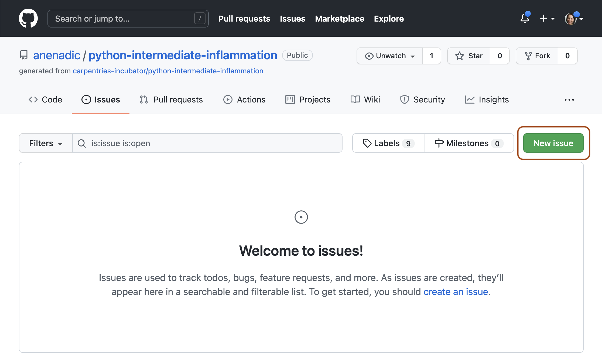
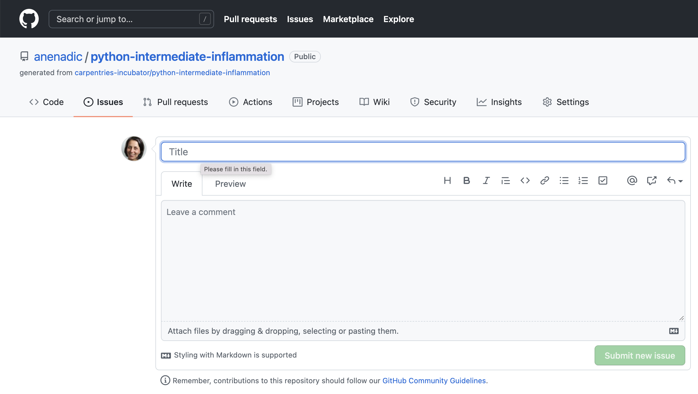
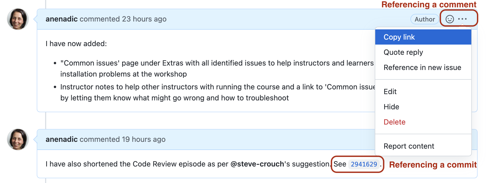

## Introduction

Developing software is a project and, like most projects, it consists of
multiple tasks. Keeping track of identified issues with the software, the list
of tasks the team has to do, progress on each, prioritising tasks for future
development, planning sprints and releases, etc., can quickly become a
non-trivial task in itself.  Without a good team project management process and
framework, it can be hard to keep track of what’s done, or what needs doing, and
particularly difficult to convey that to others in the team or share the
responsibilities.

## Using GitHub to Manage Issues With Software

As a piece of software is used, bugs and other issues will inevitably come to
light - nothing is perfect!  If you work on your code with collaborators, or
have non-developer users, it can be helpful to have a single shared record of
all the problems people have found with the code, not only to keep track of them
for you to work on later, but to avoid people emailing you to report a bug that
you already know about!

GitHub provides **Issues** - a framework for managing bug reports, feature requests, and lists of future work.

Go back to the home page for your `oxrse_unit_conv` repository in GitHub, and click on 
the **Issue** tab.
You should see a page listing the open issues on your repository - currently there should be none.

Let's go through the process of creating a new issue. Start by clicking the `New issue` button.

When you create an issue, you can add a range of details to them. They can be *assigned to a specific developer* for example - this can be a helpful way to know who, if anyone, is currently working to fix the issue, or a way to assign 
responsibility to someone to deal with it.

They can also be assigned a *label*. The labels available for issues can be customised, and given a colour, allowing you to see at a glance the state of your code's issues. The [default labels available in GitHub](https://docs.github.com/en/issues/using-labels-and-milestones-to-track-work/managing-labels) include:

- `bug` - indicates an unexpected problem or unintended behavior
- `documentation` - indicates a need for improvements or additions to documentation
- `duplicate` - indicates similar or already reported issues, pull requests, or discussions
- `enhancement` - indicates new feature requests, or if they are created by a developer, indicate planned new features
- `good first issue` - indicates a good issue for first-time contributors
- `help wanted` - indicates that a maintainer wants help on an issue or pull request
- `invalid` - indicates that an issue, pull request, or discussion is no longer relevant
- `question` - indicates that an issue, pull request, or discussion needs more information
- `wontfix` - indicates that work won't continue on an issue, pull request, or discussion

You can also create your own custom labels to help with classifying issues. There are no 
rules really about naming the labels - use whatever makes sense for your project. Some 
conventional custom labels include: `status:in progress` (to indicate that someone 
started working on the issue), `status:blocked` (to indicate that the progress on 
addressing issue is blocked by another issue or activity), `bug` (to indicate that this 
issue is a report of a bug or fault in the code), `enhancement` (to indicate that this 
issue is for a new feature for the software)

:::callout
## Manage Issues With Your Code Openly
Having open, publicly-visible lists of the the limitations and problems with
your code is incredibly helpful. Even if some issues end up languishing unfixed
for years, letting users know about them can save them a huge amount of work
attempting to fix what turns out to be an unfixable problem on their end. It can
also help you see at a glance what state your code is in, making it easier to
prioritise future work!
:::

:::challenge{id=first-issue, title="Our First Issue!"}

The `oxrse_unit_conv` repo that you cloned previously 
([https://github.com/OxfordRSE/oxrse_unit_conv](https://github.com/OxfordRSE/oxrse_unit_conv)). 
is a small toy Python project that implements some classes for SI and non-SI units (you 
can
read the `README.md` file for more information), and implements convertions
between values of different units. There are some initial units defined, but many are 
missing. 

Individually, with a critical eye, think of an aspect of the code in this repo that 
needs improvement. This could be to add a new unit to the project, or it could be to add 
any other functionality that you think would be useful, or to fix any bugs that you 
find.
:::

### Issue (and Pull Request) Templates

GitHub also allows you to set up issue and pull request templates for your
software project.  Such templates provide a structure for the issue/pull request
descriptions, and/or prompt issue reporters and collaborators to fill in answers
to pre-set questions. They can help contributors raise issues or submit pull
requests in a way that is clear, helpful and provides enough information for
maintainers to act upon (without going back and forth to extract it). GitHub
provides a range of default templates, but you can also [write your
own](https://docs.github.com/en/communities/using-templates-to-encourage-useful-issues-and-pull-requests/configuring-issue-templates-for-your-repository).

## Using GitHub's Notifications & Referencing System to Communicate

GitHub implements a comprehensive [notifications system](https://docs.github.com/en/account-and-profile/managing-subscriptions-and-notifications-on-github/setting-up-notifications/configuring-notifications) 
to keep the team up-to-date with activities in your code repository and notify you when something happens or changes 
in your software project. You can choose whether to watch or unwatch an individual repository,
or can choose to only be notified of certain event types such as updates to issues, pull requests, direct mentions, 
etc. GitHub also provides an additional useful notification feature for collaborative work - **Mentions**. 
In addition to referencing team members (which will result in an appropriate notification), GitHub allows us 
to reference issues, pull requests and comments from one another - providing a useful way of connecting things 
and conversations in your project.

### Referencing Team Members Using Mentions

The mention system notifies team members when somebody else references them in
an issue, comment or pull request - you can use this to notify people when you
want to check a detail with them, or let them know something has been fixed or
changed (much easier than writing out all the same information again in an
email).  

You can use the mention system to link to/notify an individual GitHub account or
a whole team for notifying multiple people. Typing `@` in GitHub will
bring up a list of all accounts and teams linked to the repository that can be
"mentioned". People will then receive notifications based on their preferred
notification methods - e.g. via email or GitHub's User Interface.

### Referencing Issues, Pull Requests and Comments 

GitHub also lets you mention/reference one issue or pull request from another
(and people "watching" these will be notified of any such updates). Whilst
writing the description of an issue, or commenting on one, if you type
`#` you should see a list of the issues and pull requests on the
repository.  They are coloured green if they're open, or white if they're
closed. Continue typing the issue number, and the list will narrow down, then
you can hit `Return` to select the entry and link the two.  For
example, if you realise that several of your bugs have common roots, or that one
enhancement can't be implemented before you've finished another, you can use the
mention system to indicate the depending issue(s). This is a simple way to add
much more information to your issues.

While not strictly notifying anyone, GitHub lets you also reference individual comments and commits. If you click the
`...` button on a comment, from the drop down list you can select to `Copy link` (which is a URL that points to that
comment that can be pasted elsewhere) or to `Reference [a comment] in a new issue` (which opens a new issue and references
the comment by its URL). Within a text box for comments, issue and pull request descriptions, you can reference
a commit by pasting its long, unique identifier (or its first few digits which uniquely identify it)
and GitHub will render it nicely using the identifier's short form and link to the commit in question.

:::challenge{id=first-mention, title="Our First Mention/Reference!"}

Add a mention to one of your team members using the `@` notation 
in a comment within an issue or a pull request in your repository - e.g. to 
ask them a question or a clarification on something or to do some additional work. 

Alternatively, add another issue to your repository and reference the issue you created 
in the previous exercise using the `#` notation.

:::

## Key Points:
- We should use GitHub's **Issues** to keep track of software problems and other requests for change - even if we are the only developer and user.
- GitHub’s **Mentions** play an important part in communicating between collaborators and is used as a way of alerting team members of activities and referencing one issue/pull requests/comment/commit from another.
- Without a good project and issue management framework, it can be hard to keep track of what’s done, or what needs doing, and particularly difficult to convey that to others in the team or sharing the responsibilities.
